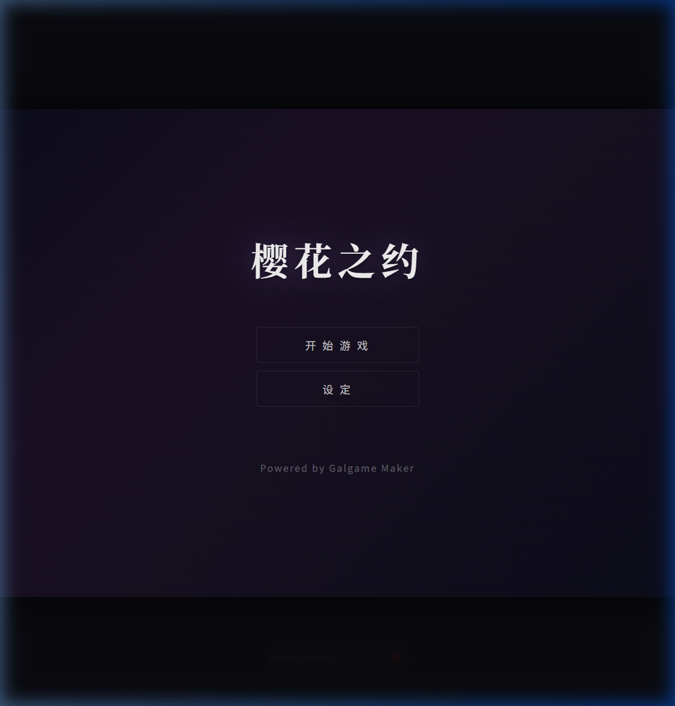
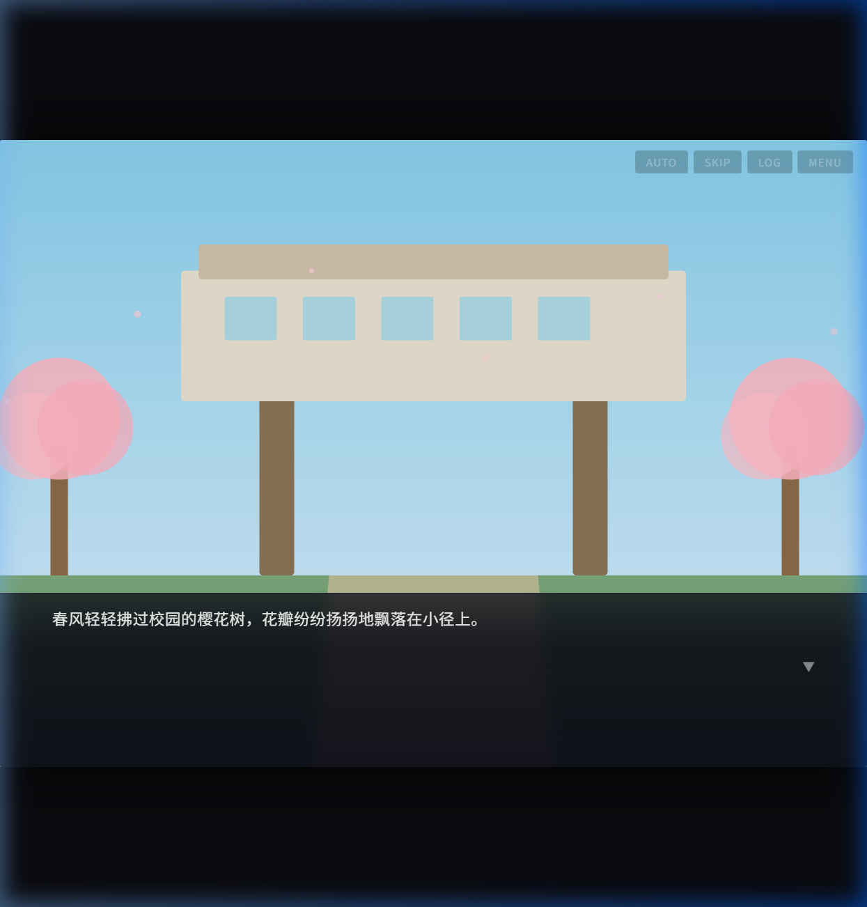
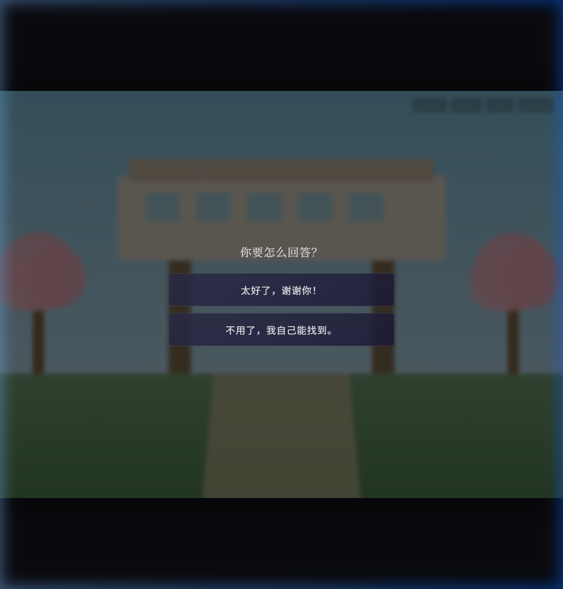
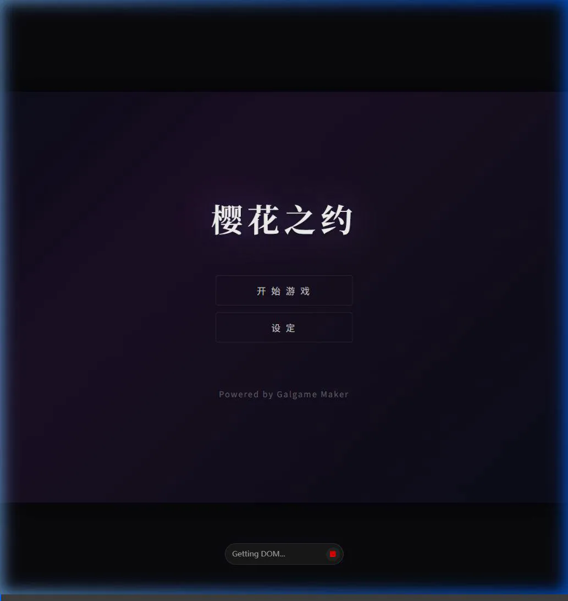

# Galgame Maker — 阶段总结 (Walkthrough)

## Phase 1: 运行时引擎核心 (Runtime Engine)

我们成功构建了一个完整的**视觉小说运行时引擎**，包含所有核心系统：

| 模块 | 文件 | 描述 |
|--------|------|-------------|
| 脚本引擎 (ScriptEngine) | `src/engine/ScriptEngine.js` | JSON 脚本加载、指令执行、变量、条件分支、存读档 |
| 事件系统 (EventEmitter) | `src/engine/EventEmitter.js` | 轻量级发布/订阅机制 |
| 音频管理 (AudioManager) | `src/engine/AudioManager.js` | BGM（循环、淡入淡出）与 SE 音效播放 |
| 存档管理 (SaveManager) | `src/engine/SaveManager.js` | 多槽位 localStorage 数据持久化 |
| 设置管理 (ConfigManager) | `src/engine/ConfigManager.js` | 用户系统设置持久化 |
| 对话框 (DialogueBox) | `src/ui/DialogueBox.js` | 打字机文本效果、点击推进/跳过 |
| 角色立绘 (CharacterLayer) | `src/ui/CharacterLayer.js` | 多角色同屏展示、表情差分、进退场渐变动画 |
| 背景图层 (BackgroundLayer) | `src/ui/BackgroundLayer.js` | 双层交叉渐变转场特效 |
| 选项分支 (ChoiceMenu) | `src/ui/ChoiceMenu.js` | 分支选项按钮与跳转映射控制 |
| 存读档界面 (SaveLoadScreen) | `src/ui/SaveLoadScreen.js` | 8 槽位存读档网格 UI |
| 历史回想 (BacklogScreen) | `src/ui/BacklogScreen.js` | 可滚动的历史对话记录界面 |
| 系统设置 (SettingsScreen) | `src/ui/SettingsScreen.js` | 音量、文字速度、自动播放速度滚动条 |
| 标题画面 (TitleScreen) | `src/ui/TitleScreen.js` | 游戏主菜单 |
| 游戏内菜单 (GameMenu) | `src/ui/GameMenu.js` | 游戏中暂停菜单 (ESC / 右键呼出) |

### 演示游戏：「樱花之约」
一个包含 2 个角色、6 个场景和 2 个结局（Good End / Normal End）的简短分支故事演示，可通过修改 `script.json` 轻松替换。

### 运行时截图

### 浏览器环境测试录像

---

## Phase 2: 可视化编辑器 MVP (Vue + Electron)

我们在极短的时间内成功开发了桌面端可视化编辑器初版 (Phase 2)。后续游戏制作者无需手写代码，即可通过界面拖拽制作 Galgame。

### 技术栈体系
- **前端框架**: Vue 3 + Vite
- **桌面容器**: Electron (通过 IPC 接口彻底打通本地系统层文件读写)
- **状态管理**: Pinia
- **路由管理**: Vue Router

### 已实现的核心功能
- **Electron 桌面端整合**: 通过 `vite-plugin-electron` 实现了 Vite 与 Electron 主副进程的无缝结合。
- **三栏式图形界面**: 实现了类似于专业 IDE 的清爽暗黑色系布局：左侧资源导航、中间高自由度工作区、右侧动态属性检查器。
- **本地资源管理器 (Assets)**: 深度利用 Node.js `fs`，自动侦测并读取 `public/game` 目录下的文件夹素材，在编辑器内提供背景图和人物立绘的网格缩略图预览，以及音频列表控件直观播放。
- **角色与变量编辑器 (Characters)**: 直接图形化读取并修改 `script.json`。支持无代码一键增加角色、配置角色的 ID 标识、给角色赋予特定的显示名称颜色，并支持动态挂载无数张表情包差分文件（Expressions）。
- **场景与剧本编辑器 (Scenes)**: （最核心的开发板块）
  - 可以像剪辑视频一般管理多重剧情场景（增删改）。
  - 提供**交互式指令时间轴**：场景内的脚本逻辑清晰可见；一键新增剧情指令，并可以通过“↑/↓”排序以及自由删除，所见即所得。
- **动态属性面板 (Inspector)**: 代码极其解耦，当你在时间轴中点击不同的指令时（例如对话、立绘展示、或者多重选项），右侧的属性面板会自动变换成该指令专属的属性调节表单（例如选择立场居左还是居右、调节点击速度等），参数更改后瞬间同步内存。
- **引擎实时预览 (Play Preview)**: 在编辑器侧边栏单独提供“播放”按钮。点击后通过 Electron IPC 弹出一个全包裹无边框的独立新窗口，挂载我们在 Phase 1 开发的纯正原生游戏引擎（指向 `public/index.html`），并加载当前正修改着的剧本进行实况试玩！

### 如何运行测试
打开系统级的控制台程序，在项目根目录执行 `npm run dev` 命令。Vite 会在后台迅速编译项目，Electron 可视化编辑器游戏窗口将自动弹出。你可以随意修改剧本数据，点击左下角的“▶ Play Preview”就可以立即测玩你创建或者修改的新游戏！
